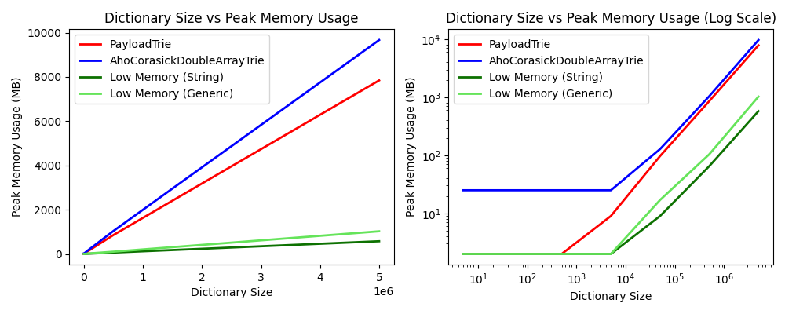
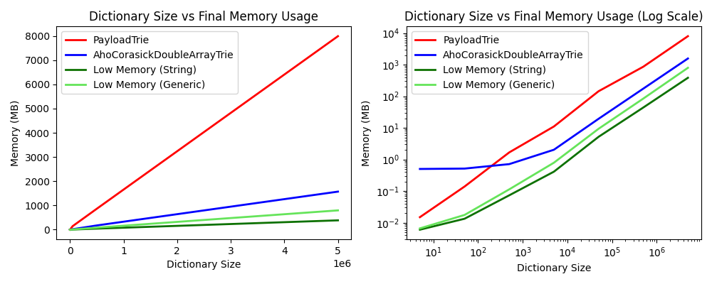
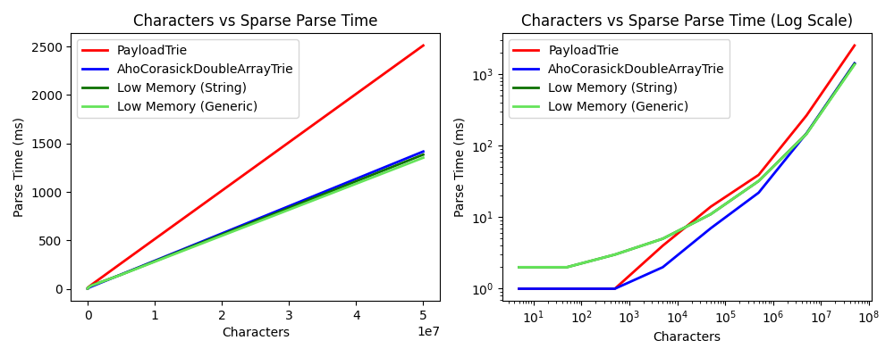
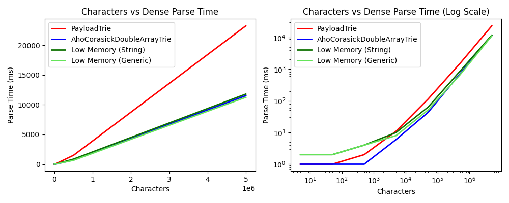
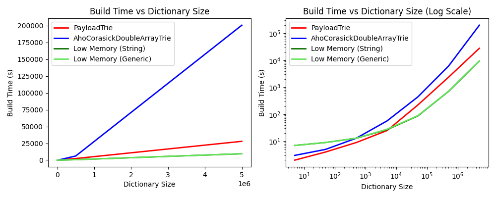

# Low Memory Aho-Corasick

## Motivation

The Aho-Corasick algorithm is used to find all instances of strings in a dictionary which appear in some input text. 
This behavior can also be generalized to arbitrary key value pairs, where each key is a string. The algorithm is very 
efficient, running in O(n) time, where `n` is the length of the input.

This implementation of the Aho-Corasick algorithm uses a very small amount of memory at only _five ints per node_, with 
the only spike in memory during construction coming from array resizing. Other JVM implementations of the algorithm on 
GitHub were found to have an unacceptably large memory spike. This made loading large dictionaries problematic. The peak
memory required for this algorithm can be around an order of magnitude less than other popular implementations, features a 
much faster build time, and has a fast runtime speed. See [here](#comparison-to-other-implementations) for more 
information.

This particular implementation of the Aho-Corasick algorithm was inspired by 
[this paper](https://www.co-ding.com/assets/pdf/dat.pdf) on the double array structure, and 
[hankcs' implementation](https://github.com/hankcs/AhoCorasickDoubleArrayTrie), which also used a double array structure 
for the algorithm. For details on how this implementation of the algorithm works see `AhoCorasickBase`, all functions
are extensively documented.

## Dependency

If using gradle one should use the following in their `build.gradle.kts` file's dependency block.

```Kotlin
implementation("com.pkware.ahocorasick:low-memory-aho-corasick:1.0.0")
```

If using POM one can use the following for the latest version of the library.

```
<dependency>
  <groupId>com.pkware.ahocorasick</groupId>
  <artifactId>low-memory-aho-corasick</artifactId>
  <version>1.0.0</version>
</dependency>
```

## Usage

Two versions of the algorithm exist.

1. `StringAhoCorasick` - Used for strings. Uses small amount of memory by not keeping any strings in memory . _This structure should be used in the common case._

2. `AhoCorasick` - Generalized version of the algorithm. Buffers all values in memory. _Should be used when one wishes to preserve casing in results for case-insensitive matching._

### Using the String Optimized Algorithm

```Kotlin
val dictionary = listOf("bobcat", "cat", "at")

val ahoCorasick = StringAhoCorasick().apply {
    addAll(dictionary) // Add iterable
    add("a") // Add single word
    build() // Build called once all words added
}

// Returns ["a", "a", "bobcat", "cat", "at"]
ahoCorasick.parse("a bobcat").map { it.value }.toList()
```

### Using the Generic Algorithm

```Kotlin
val ahoCorasick = AhoCorasick<String>().apply {
    add("np", "no problem")
    add("ty", "thank you")
    add("ttyl", "talk to you later")
    build()
}

// Returns ["no problem", "thank you", "talk to you later"]
ahoCorasick.parse("np, ttyl").map { it.value }.toList()
```

### Additional Features

One can make any version of the algorithm case-insensitive, match only on whole words, and use streams for lazy processing.
This can be useful for keeping only a small amount of results in memory at a time.

```Kotlin
val ahoCorasick = StringAhoCorasick(setOf(
    AhoCorasickOption.CASE_INSENSITIVE,
    AhoCorasickOption.WHOLE_WORDS_ONLY // Matches must be surrounded by whitespace
)).apply {
    add("BOBCAT")
    add("cAt")
    add("A")
    build()
}

// Returns ["bobcat", "A"]. Doesn't parse 'CAT' due to lazy processing.
ahoCorasick.parse("A bobcat A CAT").skip(1).limit(2).map{ it.value }.toList()
```

### Subclassing the Base Algorithm

One can extend `AhoCorasickBase` if they want to work directly with the five `int` structure. This may be useful for
working with unboxed primitives, since the generic `AhoCorasick` boxes them, wasting memory. It could also be useful 
if one only needs to work with `int`s, or if one does not need to keep track of the starting index of a key. See the 
internals of `StringAhoCorasick` or `AhoCorasick` for an example of how one can go about subclassing `AhoCorasickBase`.

## Comparison To Other Implementations

The generic version of the algorithm is compared with the low memory string version, the [Payload](https://github.com/robert-bor/aho-corasick) v0.6.2 implementation of the algorithm, and the [AhoCorasickDoubleArrayTrie](https://github.com/hankcs/AhoCorasickDoubleArrayTrie) v1.2.2 implementation.

All tests were performed on an M1 Mac with 16 GB allocated to the JVM (Temurin 8). Speed tests were averaged over 25 runs. 

### Peak Memory Usage

_Data gathered by limiting the amount of memory the JVM was allocated, and searching to the nearest MB for which the structure is no longer able to be built._



### Memory Usage

The space required to store the final structure after it has been built. _Data gathered by using IntelliJ Idea to view retained size of structures_



### Parse Speed

Runtime speed with an average of one match every 100 characters.



Runtime speed with an average of 2.5 matches every character.



### Build Time

Time required to add all dictionary terms and call `build` for each algorithm.



## Releasing

1. Make and checkout a release branch on github.
2. Change the version in gradle.properties to a non-SNAPSHOT version.
3. Update the CHANGELOG.md for the impending release.
4. Run `git commit -am "Release Low Memory Aho-Corasick X.Y.Z."` (where X.Y.Z is the new version) in the terminal or command
   line.
5. Make a PR with your changes.
6. Merge the release PR after approval, tag the commit on the main branch with
   `git tag -a X.Y.Z -m "Low Memory Aho-Corasick X.Y.Z"`(X.Y.Z is the new version).
7. Run `git push --tags`.
8. Run `./gradlew publish` in the terminal or command line.
9. Visit [Sonatype Nexus](https://oss.sonatype.org/) and promote the artifact.
10. Update `gradle.properties` to the next SNAPSHOT version.
11. Run `git commit -am "Prepare next development version."`
12. Make a PR with your changes.
13. Merge the next version PR after approval.

If step 8 or 9 fails, drop the Sonatype repo, fix the problem, commit, and start again at step 8.